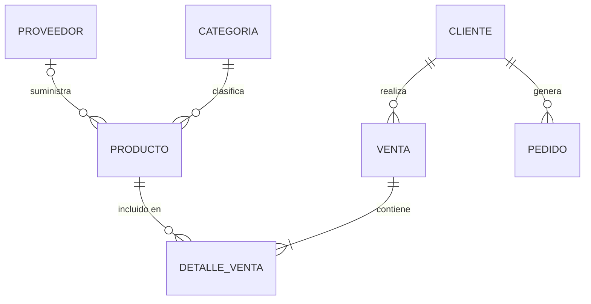

# Diagrama Entidad-Relación — ERP Django

```mermaid
erDiagram
    CATEGORIA ||--o{ PRODUCTO : "clasifica"
    PROVEEDOR |o--o{ PRODUCTO : "suministra"
    CLIENTE ||--o{ VENTA : "realiza"
    CLIENTE ||--o{ PEDIDO : "genera"
    VENTA ||--|{ DETALLE_VENTA : "contiene"
    PRODUCTO ||--o{ DETALLE_VENTA : "incluido en"
```